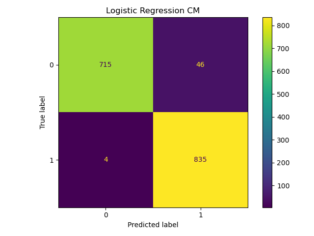
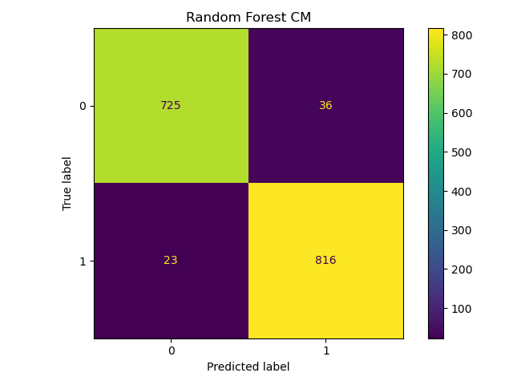
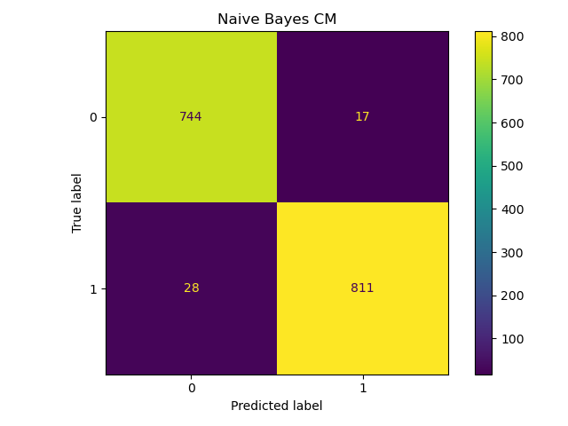
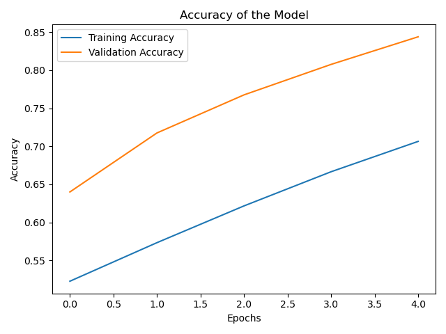
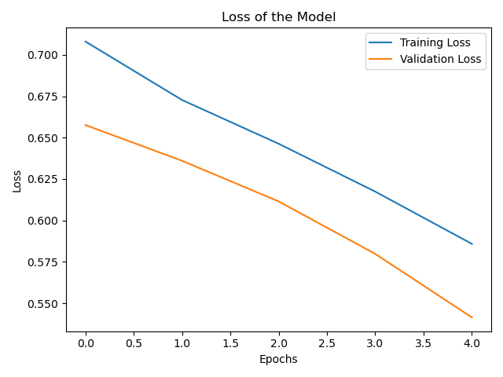

# Spam Email Classification - ML Models

A program that can classify emails as spam or not spam using machine learning algorithms.
This project was made during the Compozent internship in Machine Learning and Artificial Intelligence.


*Above chart shows the labels distributions.*

### You need to download these first for NLTK

```Python
nltk.download('stopwords')
nltk.download('punkt')
nltk.download('wordnet')
nltk.download('omw-1.4')
```

## Algorithms Used / Results

* Logistic Regression

```
Classification Report for Logistic Regression: 

              precision    recall  f1-score   support

           0       0.99      0.94      0.97       761
           1       0.95      1.00      0.97       839

    accuracy                           0.97      1600
   macro avg       0.97      0.97      0.97      1600
weighted avg       0.97      0.97      0.97      1600
```

*Above chart shows the confusion matrix for Logistic Regression*

* Random Forest

```
Classification Report for Random Forest Classifier: 

              precision    recall  f1-score   support

           0       0.97      0.95      0.96       761
           1       0.96      0.97      0.97       839

    accuracy                           0.96      1600
   macro avg       0.96      0.96      0.96      1600
weighted avg       0.96      0.96      0.96      1600
```


*Above chart shows the confusion matrix for Random Forest*


* Naive Bayes

```
Classification Report for Naive Bayes Classifier: 

              precision    recall  f1-score   support

           0       0.96      0.98      0.97       761
           1       0.98      0.97      0.97       839

    accuracy                           0.97      1600
   macro avg       0.97      0.97      0.97      1600
weighted avg       0.97      0.97      0.97      1600
```


*Above chart shows the confusion matrix for Naive Bayes*


* NN
 ```Python
model.add(tf.keras.layers.Dense(16, activation='relu'))
model.add(tf.keras.layers.Dropout(0.4))
model.add(tf.keras.layers.Dense(16, activation='relu'))
model.add(tf.keras.layers.Dropout(0.4))
model.add(tf.keras.layers.Dense(1, activation='sigmoid'))
```

*Above chart shows the accuracy of the NN model*


*Above chart shows the loss of the NN model*


