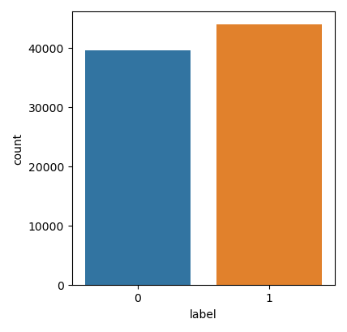

# Spam Email Classification - ML Models

A program that can classify emails as spam or not spam using machine learning algorithms.
This project was made during the Compozent internship in Machine Learning and Artificial Intelligence.


### You need to download these first for NLTK

```Python
nltk.download('stopwords')
nltk.download('punkt')
nltk.download('wordnet')
nltk.download('omw-1.4')
```

## Algorithms Used

* Logistic Regression
```
Classification Report for Logistic Regression: 

              precision    recall  f1-score   support

           0       0.99      0.94      0.97       761
           1       0.95      1.00      0.97       839

    accuracy                           0.97      1600
   macro avg       0.97      0.97      0.97      1600
weighted avg       0.97      0.97      0.97      1600
```
* TF-IDF Vectorizer
* Support Vector Machine


## Visualizition Analysis



*Above chart shows the labels distributions.*


