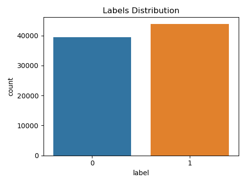

# Spam Email Classification - ML Models

A program that can classify emails as spam or not spam using machine learning algorithms.
This project was made during the Compozent internship in Machine Learning and Artificial Intelligence.

## Algorithms Used

* TF-IDF Vectorizer
* Support Vector Machine

## Visualizition Analysis

*Above chart shows the labels distributions.*

